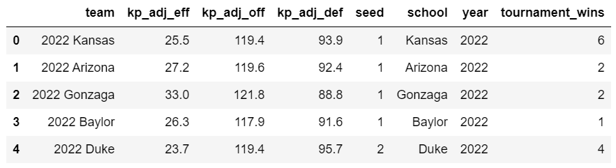
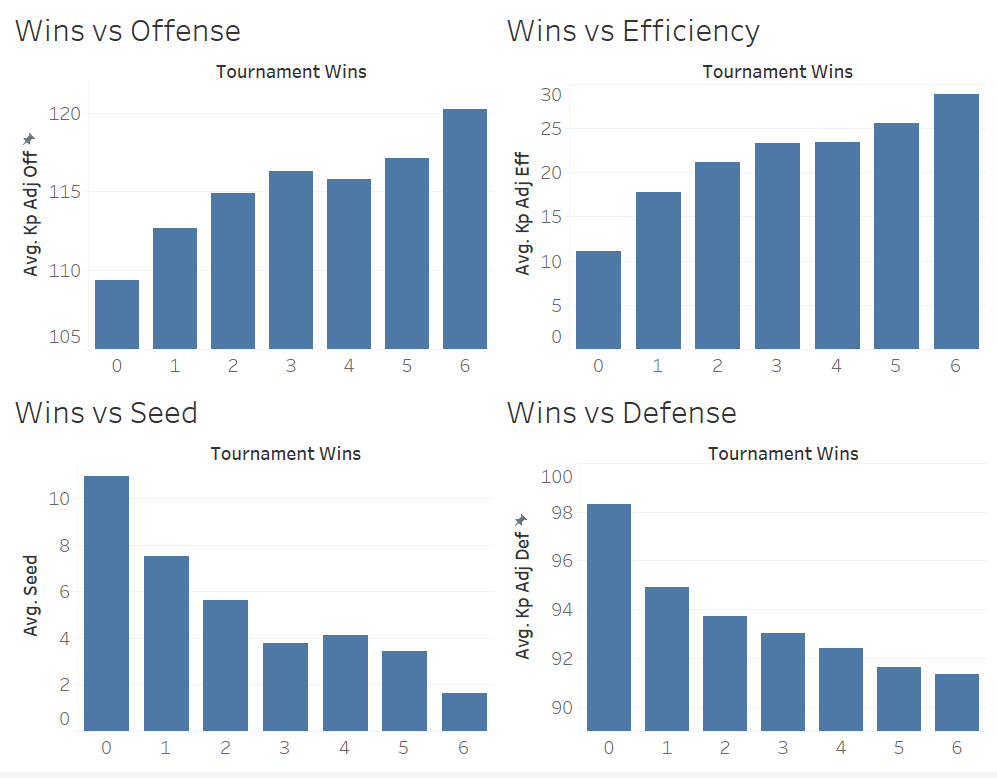
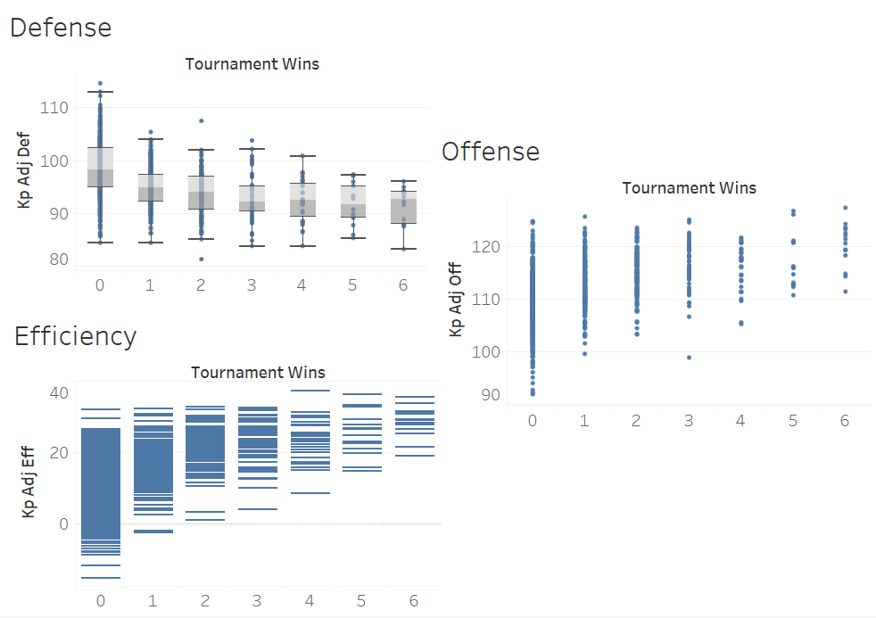
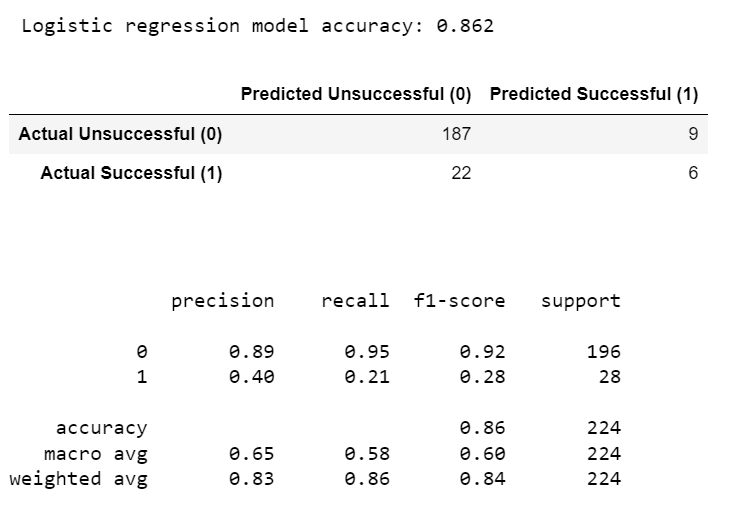

# March_Madness_Analysis
- [Tableau presentation for final project](https://kenpom.com/blog/ratings-explanation/)

## Overview
- Using a dataset of the annual NCAA basketball tournament ("March Madness"), explore the importance of defense as it relates to advancing in the tournament
- Source, download, and prepare a dataset for analysis. 
- Use a database to house the data
- Analyze the data using a machine learning model
- Create visualizations to present the analysis

## Resources
- Tournament Team Data.csv and Tournament Game Data.csv [Kaggle Dataset](https://www.kaggle.com/datasets/nishaanamin/march-madness-data?select=Tournament+Game+Data.csv) from user Nishaan Amin
- From this dataset, KenPom ratings were used. These ratings are meant to be snapshot power renkings and predictive in nature. The ratings used for each team are from after the regular season and conference tournaments, but before the NCAA tournament. The exact formula for the KenPom ratings is proprietary, but more imformation can be found [here](https://kenpom.com/blog/ratings-explanation/).
- Python with Pandas library on Jupyter Notebook to clean and transform the data
- QuickDBD to create an ERD
- PostgeSQL on pgAdmin to store the data
- Tableau Public to create visualizations and presentation
- Python with Pandas and scikit-learn libraries to create a machine learning model

## Results
- Here are some examples of code used during the clean and transform process to obtain the following table.

- Below we see strong, evenly spaced correlation for the defense metric.
- Also, weak to negative correlation going from three to four wins among the other three metrics

- Here, we are able to see individual data points and outliers from the Gantt charts.

- The following three logistic regression models were created to determine if the defensive metric had a more significant impact on results. 
There was no difference in the results of the three models:
    - One with all the inputs
    - One without the defensive metric
    - One without the offensive metric

## Summary

Is our model ready to take to Vegas? Not exactly, not with my money anyway.  but I did make some significant discoveries that warrant further discovery

- Recommendations for a future analysis
    - expand the data to include more years
    - figure out a way to adjust for player injuries
    - find distance from school to game location
    - possible try another machine learning model to analyze the deffense's affect on 

- Anything that the team would have done differently if they had more time
    - add logos to the scatter plot, make visualizaitons look better
    - explore other mistakes in data since the naming was incorrect
    - I misunderstood the initial datasets and got too far into the process to reverse course